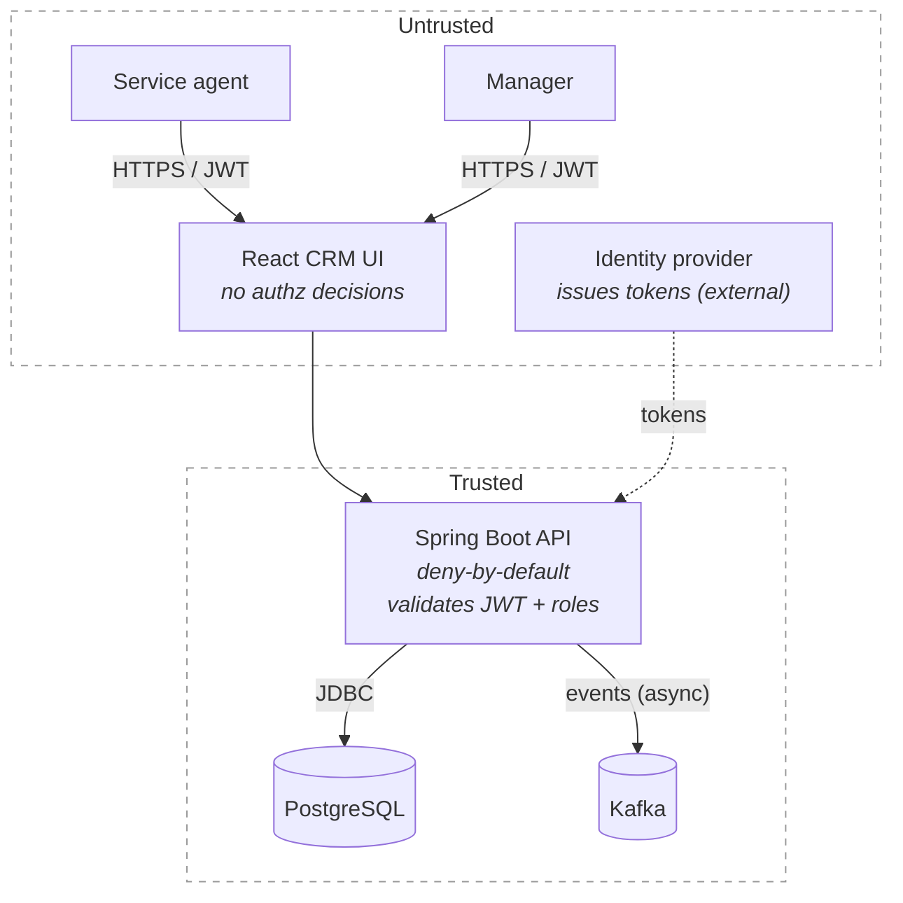

# hello-world
description

```mermaid
flowchart TB
    subgraph UNTRUSTED["Untrusted"]
        direction TB
        SA[Service agent]
        MG[Manager]
        UI["React CRM UI<br/><i>no authz decisions</i>"]
        IDP["Identity provider<br/><i>issues tokens (external)</i>"]

        SA -- "HTTPS / JWT" --> UI
        MG -- "HTTPS / JWT" --> UI
    end

    subgraph TRUSTED["Trusted"]
        direction TB
        API["Spring Boot API<br/><i>deny-by-default</i><br/><i>validates JWT + roles</i>"]
        PG[(PostgreSQL)]
        KF[(Kafka)]

        API -- "JDBC" --> PG
        API -- "events (async)" --> KF
    end

    UI --> API
    IDP -.->|tokens| API

    style UNTRUSTED fill:transparent,stroke:#999,stroke-dasharray: 5 5
    style TRUSTED fill:transparent,stroke:#999,stroke-dasharray: 5 5
```
