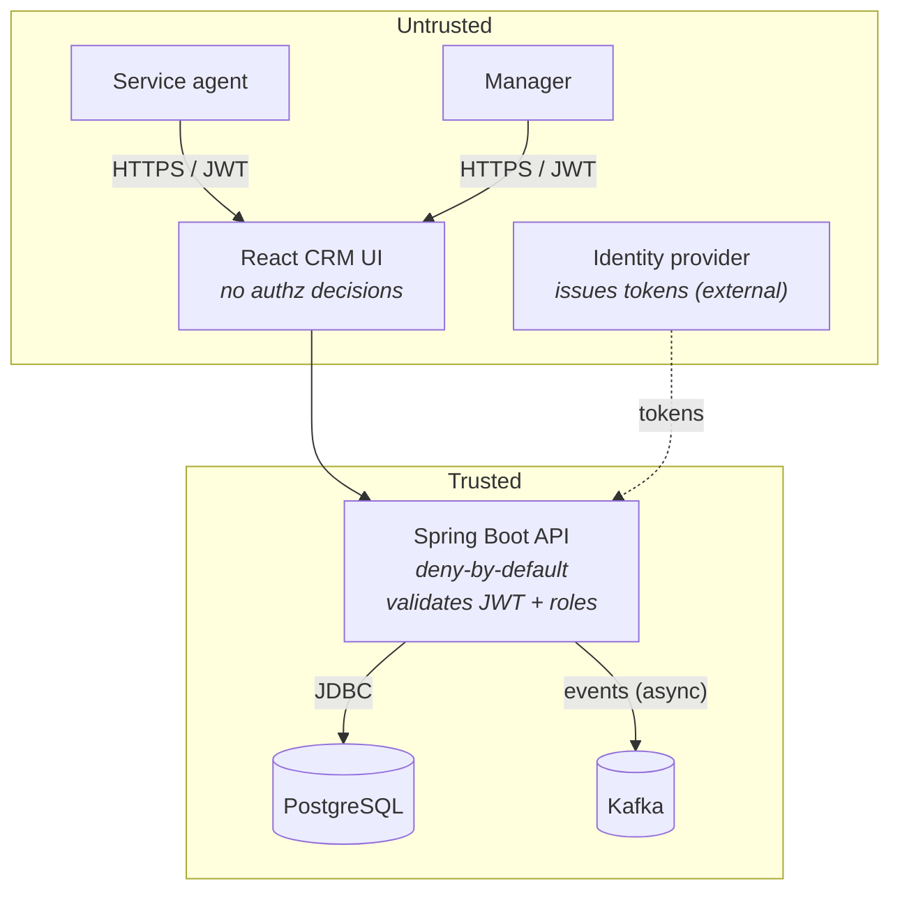
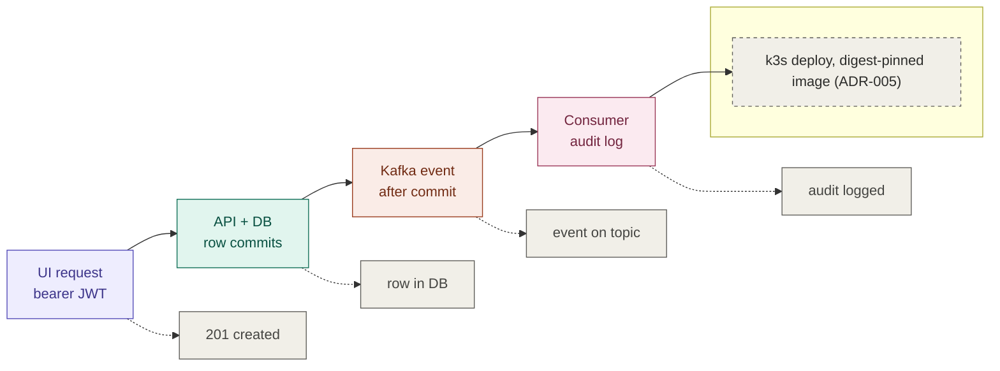

# hello-world
description





```svg
<svg width="100%" viewBox="0 0 680 320" role="img">
<title>Vertical slice demo map</title>
<desc>A request flows from the UI through authentication, persistence, and eventing, with pass signals and a deployment note below.</desc>
<defs>
<marker id="arrow" viewBox="0 0 10 10" refX="8" refY="5" markerWidth="6" markerHeight="6" orient="auto-start-reverse"><path d="M2 1L8 5L2 9" fill="none" stroke="context-stroke" stroke-width="1.5" stroke-linecap="round" stroke-linejoin="round"/></marker>
</defs>

<g fill="none" stroke="#534AB7">
<rect x="40" y="60" width="130" height="56" rx="8" stroke-width="0.5" fill="#EEEDFE"/>
<text x="105" y="80" text-anchor="middle" dominant-baseline="central" fill="#3C3489" font-size="14" font-weight="500">UI request</text>
<text x="105" y="98" text-anchor="middle" dominant-baseline="central" fill="#534AB7" font-size="12">bearer JWT</text>
</g>

<g fill="none" stroke="#0F6E56">
<rect x="186" y="60" width="130" height="56" rx="8" stroke-width="0.5" fill="#E1F5EE"/>
<text x="251" y="80" text-anchor="middle" dominant-baseline="central" fill="#085041" font-size="14" font-weight="500">API + DB</text>
<text x="251" y="98" text-anchor="middle" dominant-baseline="central" fill="#0F6E56" font-size="12">row commits</text>
</g>

<g fill="none" stroke="#993C1D">
<rect x="332" y="60" width="130" height="56" rx="8" stroke-width="0.5" fill="#FAECE7"/>
<text x="397" y="80" text-anchor="middle" dominant-baseline="central" fill="#712B13" font-size="14" font-weight="500">Kafka event</text>
<text x="397" y="98" text-anchor="middle" dominant-baseline="central" fill="#993C1D" font-size="12">after commit</text>
</g>

<g fill="none" stroke="#993556">
<rect x="478" y="60" width="130" height="56" rx="8" stroke-width="0.5" fill="#FBEAF0"/>
<text x="543" y="80" text-anchor="middle" dominant-baseline="central" fill="#72243E" font-size="14" font-weight="500">Consumer</text>
<text x="543" y="98" text-anchor="middle" dominant-baseline="central" fill="#993556" font-size="12">audit log</text>
</g>

<line x1="170" y1="88" x2="186" y2="88" stroke="#888780" stroke-width="1.5" marker-end="url(#arrow)"/>
<line x1="316" y1="88" x2="332" y2="88" stroke="#888780" stroke-width="1.5" marker-end="url(#arrow)"/>
<line x1="462" y1="88" x2="478" y2="88" stroke="#888780" stroke-width="1.5" marker-end="url(#arrow)"/>

<text x="340" y="145" text-anchor="middle" fill="#5F5E5A" font-size="12">correlation id lab-request-001 threads every hop</text>

<g fill="#F1EFE8" stroke="#5F5E5A">
<rect x="40" y="165" width="130" height="36" rx="6" stroke-width="0.5"/>
<text x="105" y="183" text-anchor="middle" dominant-baseline="central" fill="#444441" font-size="12">201 created</text>
</g>
<g fill="#F1EFE8" stroke="#5F5E5A">
<rect x="186" y="165" width="130" height="36" rx="6" stroke-width="0.5"/>
<text x="251" y="183" text-anchor="middle" dominant-baseline="central" fill="#444441" font-size="12">row in DB</text>
</g>
<g fill="#F1EFE8" stroke="#5F5E5A">
<rect x="332" y="165" width="130" height="36" rx="6" stroke-width="0.5"/>
<text x="397" y="183" text-anchor="middle" dominant-baseline="central" fill="#444441" font-size="12">event on topic</text>
</g>
<g fill="#F1EFE8" stroke="#5F5E5A">
<rect x="478" y="165" width="130" height="36" rx="6" stroke-width="0.5"/>
<text x="543" y="183" text-anchor="middle" dominant-baseline="central" fill="#444441" font-size="12">audit logged</text>
</g>

<g fill="#F1EFE8" stroke="#5F5E5A">
<rect x="40" y="220" width="600" height="50" rx="10" stroke-width="0.5" stroke-dasharray="4 4"/>
<text x="340" y="245" text-anchor="middle" dominant-baseline="central" fill="#2C2C2A" font-size="14" font-weight="500">k3s deploy, digest-pinned image (ADR-005)</text>
</g>

<text x="340" y="300" text-anchor="middle" fill="#5F5E5A" font-size="12">deny beat: 401 no token, then 403 wrong role</text>
</svg>
```
